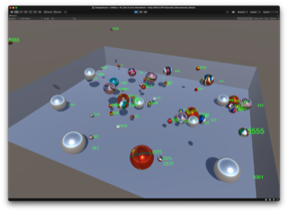

## Journée NSI-SNT
 

!!! tip ""
	Mercredi 5 avril 2023 
	[Loria](https://www.loria.fr/fr/presentation/acces-au-loria/), Nancy  
	Interventions, conférences, [ateliers](#ateliers) ont ponctué cette journée ainsi que des ateliers, visant à approfondir certaines thématiques liées au numérique.  
	**Cette année, nous avons porté une attention spéciale à la place des femmes dans les études et les métiers du numérique, une conférence plénière et une table ronde étaient dédiées à ce thème. **

 
## Programme
 

* 9h00-9h20 : Accueil 

* 9h20-9h30 : Présentation de la journée

* 9h30-10h30 : ***Les inégalités de genre en sciences et en informatique : comprendre et agir***, conférence invitée donnée par [*Clémence Perronnet*](https://www.cnrs.fr/fr/personne/clemence-perronnet), sociologue, membre du laboratoire [Centre Max Weber](https://www.centre-max-weber.fr/) et chercheuse à l'[Agence Phare](https://agencephare.com/). **[[Diaporama (pdf)](../pdf/Nancy - Les inégalités de genre en informatique comprendre et agir.pdf)]**  **[&#x1f517;
 Lien vers l'étude "Les Freins à l'accès des filles aux filières informatiques et numériques" (agence Phare)](https://agencephare.com/missions/genre-numerique-et-orientation/)**

* 10h30-11h00 : Pause café & visite libre de l'exposition [Les décodeuses du numérique](https://www.ins2i.cnrs.fr/fr/les-decodeuses-du-numerique)

* 11h00-12h30 : **Ateliers - Session 1**

* 12h30-13h00 : ***ChatGPT : un outil qui change la donne dans le domaine de l'enseignement (notamment de l'informatique) ?***, brève présentation de l'agent conversationnel ChatGPT : ses fondements, les questions qu'il soulève en matière d'enseignement, par *Yannick Parmentier*, maître de conférences en informatique à l'Université de Lorraine, membre de l'équipe [SyNaLP](https://synalp.loria.fr) du [Loria](https://www.loria.fr). **[[Diaporama (pdf)](../pdf/chatgpt_journee_nsi_20230405.pdf)]**  **[&#x1f517;
 Lien vers la vidéo "Comment fonctionnent les modèles de langage ?" (équipe Inria Flowers)](https://www.youtube.com/watch?v=K8gOvC8gvB4)**

* 13h00-14h00 : Pause déjeuner & visite libre de l'exposition [Les décodeuses du numérique](https://www.ins2i.cnrs.fr/fr/les-decodeuses-du-numerique)

* 14h00-15h30 : **Ateliers - Session 2**

* 15h30-15h50 : **Témoignages d'étudiants et étudiantes de 1ère année d'études supérieures ayant suivi l'enseignement NSI au lycée**

* 15h50-16h00 : **Présentation du spectacle [*Le procès du robot*](https://iww.inria.fr/NanSciNum/theatre-scientifique/le-proces-du-robot/)** (spectacle de médiation scientifique itinérant) par *Véronique Poirel*, chargée de communication et médiation scientifique à l'Inria Nancy Grand Est.

* 16h00-16h20 : Pause café & visite libre de l'exposition [Les décodeuses du numérique](https://www.ins2i.cnrs.fr/fr/les-decodeuses-du-numerique)

* 16h20-17h20 : **"Comment attirer les femmes vers les filières / carrières scientifiques ? Quelques actions à destination des lycéen&middot;ne&middot;s et étudiant&middot;e&middot;s"**, table ronde faisant intervenir *Marie Duflot-Kremer*, maîtresse de conférences en informatique à l'Université de Lorraine et *Anne-Catherine Sarbiewski* et *Vincent Cantus*, enseignants de NSI au lycée Saint-Exupéry de Fameck, pour leur implication dans le projet  [*"1 scientifique - 1 classe : Chiche"*](https://chiche-snt.fr/le-projet/), ainsi que *Maya Hiba*, ingénieure informaticienne chez Urbanloop, *Isabelle Le May* et *Agnès Volpi*, co-déléguées régionales de l'association [*"Elles bougent"*](https://www.ellesbougent.com/association/) &#x153;uvrant en faveur de la mixité  dans le secteur professionnel.

* 17h20-17h30 : Clôture de la journée

 
## Conférence
 

!!! danger "***Les inégalités de genre en sciences et en informatique : comprendre et agir*** par Clémence PERRONNET, sociologue."
    Résumé : Le constat de la sous-représentation des femmes en sciences est bien connu, et pourtant : les inégalités de genre persistent et s'aggravent, surtout en informatique. Pourquoi cette discipline attire-t-elle encore moins les filles que les autres ? Se lancer et réussir en informatique ou dans le numérique, est-ce une question d'inné (de « génie ») ou d'acquis ? De compétences ? De goût et de curiosité ? À partir de plusieurs enquêtes de terrain sociologiques, cette conférence explore la construction des rapports aux sciences et propose des pistes pour réduire les inégalités.

 
## Table ronde
 

!!! danger "***Comment attirer les femmes vers les filières scientifiques ?***"
    Dans cette table ronde interviendront des enseignant&#183;e&#183;s et chercheur&#183;euse&#183;s ayant participé au programme [Chiche](https://chiche-snt.fr/le-projet/) à destination des élèves de seconde, et des membres de l'association [Elles bougent!](https://www.ellesbougent.com/colleges-lycees/) qui permet notamment aux élèves de collège et lycée de rencontrer des femmes ingénieures, techniciennes ou étudiantes afin de casser certains biais de représentation sur les femmes dans les carrières scientifiques.

 
## Exposition
 

!!! danger "Les décodeuses du numérique"
    À l'occasion de la journée NSI seront exposées les planches de la bande dessinée [*Les décodeuses du numérique*](https://www.ins2i.cnrs.fr/fr/les-decodeuses-du-numerique) retraçant 12 portraits de chercheuses, enseignantes-chercheuses et ingénieures travaillant dans les sciences du numérique. Ce projet a été coordonné par la cellule parité-égalité de l'Institut des Sciences de l'Information et de leurs Interactions (INS2I) du CNRS, lauréate de la [médaille 2022 de la médiation scientifique du CNRS](https://www.cnrs.fr/fr/decouvrez-les-laureats-2022-de-la-medaille-de-la-mediation-scientifique-du-cnrs).

 
## Ateliers
 

##### 1) Ateliers courts (1h30)
 

!!! tip "Atelier 1 (NEW) : **L'informagie, ou comment parler de science avec des paillettes dans les yeux**, Marie DUFLOT-KREMER (atelier d'1h30, session 1 ou 2)"    
    En tant qu'informaticien.ne, on doit souvent se battre contre l'idée que la machine est une boîte noire, qu' "on n'y comprend rien", et que de toutes façons l'informatique c'est "bien trop compliqué pour moi". Alors on parle de science, on montre, on explique. Et si pour une fois on le faisait... au travers de tours de magie ? Dans cet atelier vous découvrirez comment parler d'algorithme, de binaire, de compression ou de codes correcteurs d'erreur, le tout au travers de tours d' "informagie" basés sur la science, sans aucun talent particulier en manipulation.

!!! tip "Atelier 2 (NEW) : **S'orienter suite à une formation NSI**, Frédérique BEAUDEUX (atelier d'1h30, session 1 ou 2)"
    Comment aider les élèves à construire leur parcours personnel ? Quelles activités mettre en place pour leur permettre de découvrir les différentes possibilités d'orientation classiques ou plus originales avec la discipline NSI ? À partir d'exemples, nous échangerons sur les actions réalisables et construirons un guide commun pour faciliter l'orientation des élèves.

!!! tip "Atelier 3 (NEW) : **Reconnaissance automatique de personnes basée sur un réseau de neurones**, Pierre-Frédéric VILLARD (atelier d'1h30, session 1 ou 2)"
    De plus en plus de systèmes utilisent de l'intelligence artificielle basée sur de l'apprentissage par réseaux de neurones (chatGPT, véhicules autonomes, assistant vocal, etc.) Aussi, il y a une forte chance que les élèves en NSI soient confrontées à cette problématique dans le futur. Dans cet atelier, nous allons voir comment programmer une application de reconnaissance de personnes (Asterix ou Obelix) en allant de l’acquisition de données à la mise en production dans une appli web, en passant par la conception d’un réseau de neurones et par son apprentissage. Nous discuteront aussi des problèmes éthiques liés à l’utilisation de ces technologies.

!!! tip "Atelier 4 (NEW) : **L'écoute de la langue comme guide pour l'intelligence artificielle et le numérique**, Nazim FATÈS (atelier d'1h30, session 1 ou 2)"
    Quiconque tente sérieusement d'y voir clair sur la question de l'intelligence artificielle se trouve vite noyé sous un déluge d'informations dont l'effet est souvent de saturer l'esprit et de le désorienter. Il n'y a rien de surprenant à cela, car si les bases mathématiques et algorithmiques du "monde numérique" sont bien établies, la façon dont les médias et la vulgarisation scientifique en parlent a tout pour dérouter. Nous proposons ici de revenir à l'étude de quelques textes historiques et de laisser parler les mots pour comprendre sur quelles fondations le monde numérique s'est construit : apprentissage, décision, adaptation, intelligence, impact, automate, cybernétique, éthique... La langue parle, et son écoute attentive peut devenir une ressource pour des élèves et étudiants en quête de sens...

!!! tip "Atelier 5 (NEW) : **Auto-Multiple Choice, un outil pour suivre les progrès de ses élèves**, Yannick PARMENTIER (atelier d'1h30, session 1 ou 2)"
    Le monde des logiciels libres contient beaucoup d'outils mobilisables pour l'enseignement (en particulier de l'informatique). Dans cet atelier *technique*, nous souhaitons vous faire découvrir l'outil Auto-Multiple-Choice, un éditeur de questionnaires, qui offre beaucoup de fonctionnalités dont notamment la gestion des questions (e.g. ordre aléatoire, groupes de questions, etc.) et de l'évaluation (correction semi-automatique des questions). Nous verrons comment prendre en main cet outil, au moyen d'une version virtualisée, et évoquerons un exemple d'utilisation en 1ère année de BUT Informatique.

!!! tip "Atelier 6 (NEW) : **Des algorithmes pour dessiner des plantes (et d'autres choses): les L-systèmes**, Martin CANALS (atelier d'1h30, session 1 ou 2)"
    Les L-systèmes, inventés par le biologiste hongrois Aristid Lidenmayer, sont des systèmes de réécriture (grammaire) permettant de modéliser le développement d'un végétal. Le système de réécriture permet de générer une chaîne de caractères, qui, interprétée par une tortue de type Logo permet le dessin d'un végétal. Lors de l'atelier nous aborderons les différents aspects de la programmation de ces systèmes et envisagerons le travail que l'on peut confier aux élèves de NSI. Seules les grammaires hors contexte seront abordées, avec éventuellement l'introduction de dérivations aléatoires. Pour la partie dessin nous utiliserons le module Turtle et étudierons une implémentation de tortue en 3D. La programmation se fera en python utilisant la programmation objet, les dictionnaires et une structure de pile.

!!! tip "Atelier 7 (NEW) : **Echanges d'expériences d'enseignement en classe de terminale de spécialité NSI**, Jérôme METZLER (atelier d'1h30, session 1 ou 2)"
    L'atelier, ouvert aux échanges et aux partages d'expériences, devrait se présenter en trois parties. Une première partie devrait permettre d'échanger autour d'une progression annuelle effective avec une proposition de contenus réalisés partagés et commentés (activités, cours, exercices, évaluations). Une deuxième partie devrait permettre de présenter une proposition d'initiation au projet en première par le biais d'une activité, clés en main, d'étude de codage par plages (finalisée par un tracé avec turtle). Une troisième partie devrait permettre de présenter une proposition d'idée de projet de terminale par le biais d'un projet, clés en main, d'étude de complexités de tris (finalisée par un tracé avec matplotlib). L'ensemble des réalisations présentées lors de cet atelier devrait être partagé à tous les participants, afin que chacun puisse, je l'espère, enrichir ses supports dans l'enseignement au quotidien.

 
##### 2) Ateliers longs (3h)
 

!!! tip "Atelier 8 : **Blockly, prise en main de l'API**, David LANGLOIS (atelier de 3h, sessions 1+2)"
    Blockly est un ensemble de fonctionnalités javascript (API) permettant de manipuler des blocs graphiques pour rédiger des algorithmes. Les algorithmes peuvent alors être exécutés pour modifier un "monde" (par exemple: dépacer un robot dans un labyrinthe). Plusieurs applications web basées sur blockly existent (comme [https://blockly-games.appspot.com/turtle?lang=fr](https://blockly-games.appspot.com/turtle?lang=fr)), qui permettent de découvrir les bases de l'algorithmique en résolvant des défis. L'atelier consiste à découvrir l'API afin de créer ses propres applications. Au cours de l'atelier, le lien avec les programmes informatiques du lycée sera fait. Notamment, on s'intéressera à l'articulation entre l'univers fermé des blocs graphiques de scratch, et celui ouvert de blockly. On verra en quoi derrière blockly se cache un langage de programmation écrit, du XML, du javascript. Blockly peut-il être utilisé comme un retour aux sources (le scratch du collège) avec une prise de recul suite à la formation du lycée? L'atelier est destiné à des participants maîtrisant les bases de javascript.

!!! tip "Atelier 9 : **L'apprentissage par renforcement, ça marche ! ("un chocolat ?")**, Vincent THOMAS (atelier de 3h, sessions 1+2)"
    Dans les problèmes d'apprentissage par renforcement, un système (typiquement un robot) est lâché dans un monde inconnu et doit modifier son comportement au fur et à mesure de ses expériences pour accomplir une tâche donnée au départ. L'atelier aura pour objectif de mettre en oeuvre (en python) des algorithmes permettant à un agent d'apprendre un comportement intelligent en tirant parti de son vécu. Ces algorithmes sont simples à implémenter, adaptés à de nombreux problèmes et utilisables dans des projets d'intelligence artificielle (pour contrôler des systèmes mais aussi pour parler d’apprentissage en général).   (1) Dans un premier temps, on proposera une manière simple de représenter des agents devant prendre des décision.  (2) On s'intéressera ensuite à l'équation de Bellman qui exprime le lien entre les actions effectuées et leurs conséquences futures et qui permet de raisonner à long terme.  (3) Enfin, on mettra en œuvre un algorithme d'apprentissage par renforcement simple (le Q-learning) pour modifier progressivement le comportement d'un agent afin de résoudre la tâche qui lui a été confiée.

!!! tip "Atelier 10 (NEW) : **AcheteZen avec Flask, prise en main d'un framework web Python**, Abdellatif KBIDA et Jocelyn TOURNIER (atelier de 3h, session 1+2)"
    Dans le cadre de cet atelier, on apprendra en guise de tutoriel Flask à rapidement développer une petite application web « AcheteZen ». Cette webapp est une version light d'un site de vente en ligne avec gestion de produits, d'utilisateurs et d'avis. Cette activité peut être menée en classe de 1er NSI sous forme de mini-projet dans la partie interface homme-machine-web des prolongements à l'aide de bases de données sont possibles en terminale. On y traitera l'installation, la configuration et la mise en route de Flask, puis le développement de premiers exemples de script.  Mot-clés : Framework, Python, client-serveur, Web, formulaire, Modèle Vue Contrôleur/Template.   Pré-requis : HTML, en particulier les formulaires, données structurées (dictionnaire JSON), Python.  Niveau : novice ou débutant en Flask (apporter son ordinateur portable).
	
!!! tip "Atelier 11 (NEW) : **Développement d'application 3D avec Unity**, Laurent PIERRON (atelier de 3h, session 1+2)"
    Vous êtes-vous demandé comment expliquer la création de jeu vidéo à vos élèves ? Vous souhaiteriez développer une application de Réalité Virtuelle en cours ? Vous vous demandez comment vous pourriez présenter des données en dans des mondes en 3D ?  Venez créer votre univers...  Dans cet atelier, vous découvrirez la création d'application en 3D, à travers une application de visualisation de données sous forme de boules colorées de différentes tailles, rebondissantes et interagissants en suivant les lois de la physique.  Prérequis:  Unity Hub : [https://unity.com/download](https://unity.com/download)  Unity 2020.3.12f1 : installé depuis Unity Hub  IDE (Visual Studio Code recommandé) : [https://docs.unity3d.com/Manual/ScriptingToolsIDEs.html](https://docs.unity3d.com/Manual/ScriptingToolsIDEs.html)    Téléchargement : [https://gitlab.inria.fr/tutos-technos/nsi-unity/-/releases/v1.1.1](https://gitlab.inria.fr/tutos-technos/nsi-unity/-/releases/v1.1.1)   Atelier en ligne : [https://tutos-technos.gitlabpages.inria.fr/nsi-unity](https://tutos-technos.gitlabpages.inria.fr/nsi-unity)

 
## Quelques liens
 

- [Reportage Arte](https://www.arte.tv/fr/videos/113490-000-A/sciences-faire-de-la-place-aux-femmes/) autour d'une intervention de l'association [Elles bougent!](https://www.ellesbougent.com/) auprès d'élèves du primaire
- [Présentation de la *Mission pour la Place des Femmes* au CNRS](https://youtu.be/77H1ZRXHi6w)
- [Présentation de la bande dessinée *les décodeuses du numérique*](https://images.cnrs.fr/video/7549)
